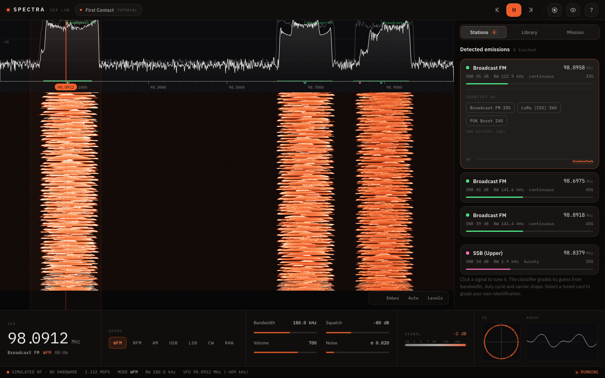
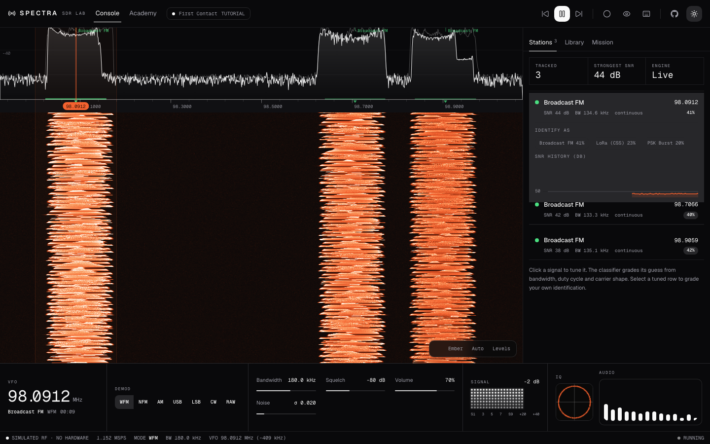
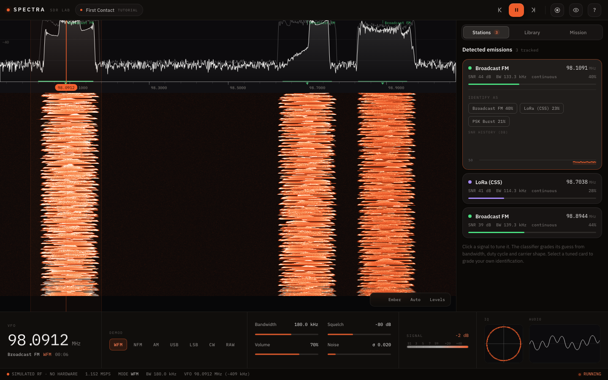
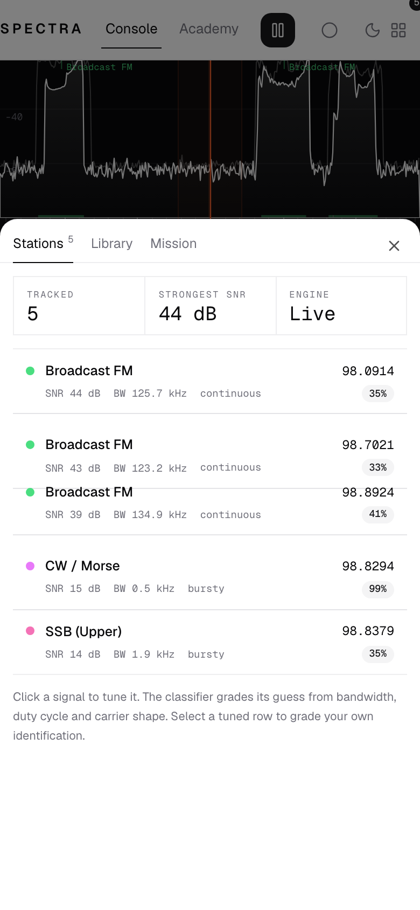
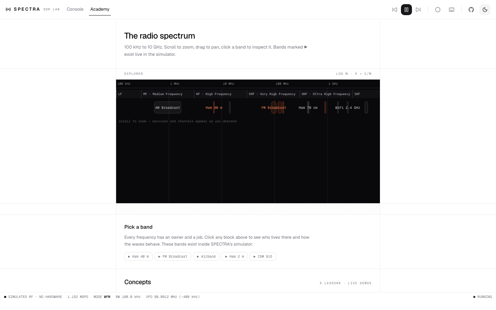
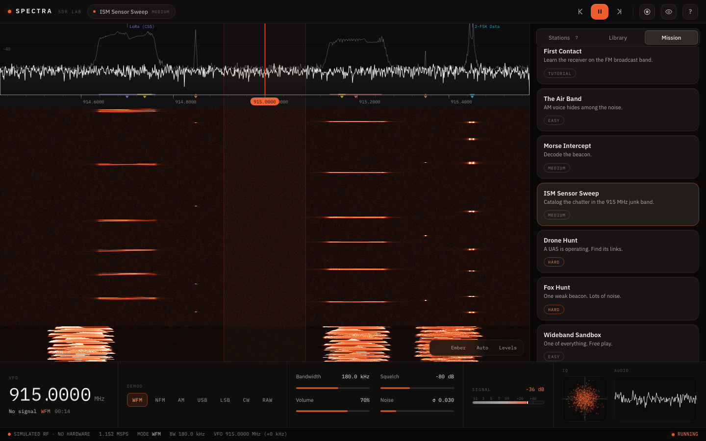

<div align="center">

# SPECTRA

### A software-defined radio lab in your browser — no hardware required.

**Live: [spectra-one.vercel.app](https://spectra-one.vercel.app)** — every push to `main` deploys automatically via Vercel.

A physics-based RF **signal-environment simulator**, a real **DSP receiver** with live demodulated audio, automatic **emission detection & identification**, **SigMF** recording, and mission-based **training** — all running client-side in TypeScript. It's a flight simulator for spectrum operators.

</div>



---

## Why this exists

Open-source SDR is bimodal: world-class native DSP (GNU Radio, SDR++, URH) on one side, and browser front-ends that are only **remote controls for a physical radio** (OpenWebRX, WebSDR, KiwiSDR) on the other. The one hardware-free browser tool, IQEngine, only views *static* recordings. **Nobody synthesizes a live, dense, realistic RF spectrum in the browser and hands you a real receiver to work it.** SPECTRA is that missing tool. Full analysis in [`docs/RESEARCH.md`](docs/RESEARCH.md); product thesis in [`docs/PRODUCT.md`](docs/PRODUCT.md).

## What it does

- **Simulates a live band.** 12 emitter types — broadcast/narrowband FM, AM, SSB (USB/LSB), CW/Morse, 2-FSK, OOK/ASK, LoRa chirps, PSK bursts, frequency hoppers, and pulsed radar — rendered into a wideband I/Q stream with a real noise floor, in real time.
- **Is a real receiver.** Click the spectrum to tune. Demodulate **WFM / NFM / AM / USB / LSB / CW** with live audio, adjustable bandwidth, squelch, and volume. The DSP is genuine — FFT, FIR channelizers, a quadrature FM discriminator, and Weaver-method SSB (so USB and LSB actually differ).
- **Finds and identifies signals.** A CFAR-style detector locates and tracks every emission; a classifier guesses each modulation from bandwidth, duty cycle, and carrier shape with a confidence score. A live **Morse decoder** reads CW beacons.
- **Teaches.** An **interactive signal library** lets you inject any signal into the live band to see and hear it. **Mission scenarios** give you scored objectives and a graded "identify this emitter" quiz. The **RF Academy** maps the whole spectrum from 100 kHz to 10 GHz and drops you into the simulator at any band it covers.
- **Records to SigMF.** Capture the wideband I/Q and export a standard, annotated `.sigmf-meta` + `.sigmf-data` pair that opens in IQEngine, inspectrum, or GNU Radio.
- **Mints your Operator Card.** Signals you identify, missions you complete, and course progress are tracked on a persistent operator record — rendered as a shareable 1080×1080 license-style card with a QR back to the app (top bar → card icon). Download the PNG, copy it, or copy the share text and post it.

## A real receiver console

An engineering-grid instrument in the [chanhdai.com](https://chanhdai.com) idiom — zinc-monochrome ruled chrome (light default + animated dark toggle, Geist Sans/Mono) around an always-dark spectrum stage. The **receiver deck** sits under the panadapter: rolling-digit **VFO readout** (click to type a frequency), demod mode toggle group, console **faders** for bandwidth / squelch / volume / noise, a dot-matrix **S-meter VU** ([ElevenLabs UI](https://github.com/elevenlabs/ui) Matrix), and live **scopes** — IQ constellation plus an ElevenLabs **BarVisualizer** fed by a `MediaStreamDestination` tap on the engine's Web Audio graph. The stage integrates the tuner scale with kind-colored detection carets that tie 1:1 to the lined Stations list, a **peak-hold** envelope, **wheel-zoom** centered on the cursor with a live frequency/dB hover readout, selectable **colormaps**, and an **auto-leveling** dB range. Fully responsive: panels become a bottom sheet on small screens.

**Keyboard:** `Space` start/stop · `← →` nudge tune (`Shift` coarse) · `↑ ↓` hop detections · `M` cycle mode · `R` record · `?` shortcuts.





Works on mobile too — the console condenses and the panels slide up as a sheet:



## RF Academy

A second view (top bar → **Academy**) with three tabs:

- **Explorer** — the radio spectrum from 100 kHz to 10 GHz on a zoomable log axis, with an inspector per band and five live concept demos.
- **Course** — a complete 25-chapter ham-radio curriculum (foundations, electricity, radio theory, station equipment, propagation) with **206 quiz questions** with explanations, per-chapter bench labs, and progress tracking — adapted from [The Radio Bench](https://github.com/jemcik/the-radio-bench) (MIT). Twelve interactive widgets (AM/FM modulation explorers, SWR, resonance, dipole length, dB, Ohm's law…) are embedded in the chapters they teach.
- **Reference** — a searchable 284-term glossary with see-also links, plus the widget playground: 14 interactives including a UTC-synced **NCDXF beacon clock**, a **beam-heading** calculator (Maidenhead grid ↔ great-circle), and an **antenna-length** calculator (dipole/vertical/loop with end-effect K).

Everything hands off into the simulator: bands marked ▶ and every chapter's try-it chips load the matching live scenario, so you read about FM and then hear it.



**ISM band** — the unmistakable diagonal LoRa chirp ramps and stuttering OOK/FSK sensor bursts:



## Quick start

```bash
npm install
npm run dev          # http://localhost:5173  — press the play button (or Space)
```

```bash
npm test             # 35 unit tests (DSP, simulator, receiver, detector, classifier)
npm run build        # type-check + production build
```

> Uses Web Workers, AudioWorklet, and Canvas — best in a Chromium-based browser. All audio starts on the first play (browser autoplay policy). Nothing leaves your machine.

## Missions

| Mission | Band | Skill |
|---|---|---|
| **First Contact** | FM broadcast | Tune & identify a WFM station (tutorial) |
| **The Air Band** | Airband | Find AM voice by its carrier spike |
| **Morse Intercept** | HF / 40 m | Tune CW and let the decoder read the beacon |
| **ISM Sensor Sweep** | 915 MHz ISM | Catalog LoRa / OOK / FSK sensors |
| **Drone Hunt** | 2.4 GHz-style | Identify a PSK downlink and a hopping control link |
| **Fox Hunt** | 2 m | Dig a weak beacon out of the noise |
| **Beacon Carousel** | 14.1 MHz | Copy the real NCDXF beacon network, UTC-synced |
| **Wideband Sandbox** | — | One of everything; free play |

## How it works

Everything runs in a **DSP Web Worker**: the simulator generates wideband I/Q at 1.152 MSPS, one path FFTs it for the waterfall, another tunes/decimates/demodulates it to 48 kHz audio, and a third detects and classifies emissions. The main thread renders Canvas and drives an AudioWorklet. See [`docs/ARCHITECTURE.md`](docs/ARCHITECTURE.md).

```
src/
├── dsp/        FFT, windows, FIR, mixer, decimator, spectrum, receiver, detector  (unit-tested)
├── sim/        emitters, scene, message audio, modulation, morse, seeded RNG
├── id/         rule-based signal classifier
├── engine/     DSP worker, main-thread orchestrator, message protocol
├── scenarios/  training missions + objective scoring
├── recording/  SigMF export / import
├── store/      Zustand UI state
├── academy/    RF Academy: log-spectrum explorer, band inspector, live concept lessons
└── ui/         spectrum+waterfall stage, receiver deck (VFO, faders, meter, scopes), stations / library / mission panels
```

**Charts & UI kit:** the per-signal SNR-history strip uses **[uPlot](https://github.com/leeoniya/uPlot)** — a tiny canvas charting library that streams at 60 fps via imperative `setData`. The spectrum/waterfall and IQ scopes are hand-rolled canvas for maximum throughput. Chrome is **Tailwind CSS v4 + shadcn/ui** with components from **[ElevenLabs UI](https://github.com/elevenlabs/ui)** (MIT) and the **[@ncdai registry](https://chanhdai.com/blocks)**; UI motion is **motion** springs (see `DESIGN.md`). (Considered but rejected `bklit` — it's a lovely SVG/Motion component set, but SVG re-render at signal rates janks; see `docs/RESEARCH.md`.)

**Built directly on the research:** the receiver mirrors Signal-Weaver's tested pure-TS demodulators; the worker+AudioWorklet path follows SDRLab; the sample-source seam generalizes web_hackrf's swappable-driver idea; and the whole thing turns hackrf-webui's "simulator mode" (a test convenience) into the product. Unlike several of the seed repos, this is clean-room and permissively licensed.

## Roadmap

Next up: a **macOS menu-bar WiFi console** (CoreWLAN channel-occupancy graphs, RSSI history, security audit — see [`docs/ROADMAP.md`](docs/ROADMAP.md) for the phased plan and research notes), then **WebUSB SDR ingest** and a **WiFi sensing lab**. Near-term additions: a morse/CW audio trainer, per-card dynamic OG images and FCC callsign validation for the Operator Card (v2 notes in `docs/ROADMAP.md`).

More emitters (ADS-B, POCSAG, APRS, digital voice), fading/multipath channels, a spectrogram chirp detector + learned classifier (trained on the simulator's own labeled output), a scenario editor, and a WebUSB **hardware-ingest** path so a real HackRF/RTL-SDR drops in behind the same receiver.

## License

MIT — see [`LICENSE`](LICENSE).

*Built as a from-scratch clean-room implementation. All signals are simulated; SPECTRA neither transmits nor requires any radio hardware. Course content adapted from The Radio Bench (MIT) — see [`NOTICE`](NOTICE).*
