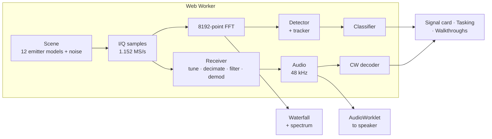

# SPECTRA

**Learn radio by working a listening post — in your browser, with no radio.**

SPECTRA simulates a live slice of the radio spectrum and hands you a real
software receiver to work it. You tune, pick the demodulator, narrow the
filter, copy Morse, work a repeater, and name what you're hearing. Guided
walkthroughs teach each skill on the live receiver, intercept missions test
it, and a full license-prep section gets you through the ham exam.

**▶ [spectra-one.vercel.app](https://spectra-one.vercel.app)** — free, no
sign-up, built for phones as much as desktops.

## Why it exists

Every browser SDR — OpenWebRX, WebSDR, KiwiSDR — is a remote control for
someone else's antenna. That's great once you know what you're doing, and no
help while you're learning: you can't choose what's on the air, nothing tells
you whether you got it right, and the band is quiet whenever you sit down to
practice.

SPECTRA generates the signals itself. Because the simulator places every
emitter, it always knows the answer, so it can coach you step by step, score a
challenge, and grade an exam question, which no live receiver can do.

## What's in it

### Train — learn the receiver by using it

- **Seven guided walkthroughs**, about 19 minutes in all: tune and listen,
  pick the right mode, narrow the filter, open the squelch, work a repeater,
  scan the band, and identify a signal. Each runs on the live receiver. A coach
  card says what to do and why, a ring marks the control to use, and the step
  advances when the receiver shows you actually did it.
- **A 25-chapter course** in five parts, from electricity fundamentals through
  propagation and regulations, with a 284-term inline glossary. Adapted from
  The Radio Bench.
- **Explorer**: the radio spectrum from 100 kHz to 10 GHz on one log axis,
  with the bands and services that live on it.

### Receiver — a live spectrum to work

- A spectrum and waterfall over 1.152 MHz of simulated band, computed in real
  time. Pinch to zoom; tap a signal to lock onto it.
- **Seven demodulators** (WFM, NFM, AM, USB, LSB, CW, raw) with bandwidth,
  squelch, and volume on knobs built for touch.
- **Twelve signal types**: broadcast FM, NFM voice, AM, both sidebands, CW,
  2-FSK, OOK sensors, LoRa chirps, PSK bursts, frequency hoppers, and pulsed
  radar.
- **Voice traffic on the air**: 51 scripted transmissions across a 2 m
  repeater, a 70 cm net, airband, HF sideband, and talk radio, modulated
  through the receiver's own DSP chain and shown as live transcripts.
- **Tap any signal** for a card that says what it is, whether you're listening
  in the right mode (one tap fixes it), and what's being said, and lets you
  confirm the ID.
- A scanner that stops on activity, an intercept log stamped in UTC, a CW
  decoder, and recording to SigMF, the open I/Q format that inspectrum and
  IQEngine read.

### Tasking — intercept missions

- **Fifteen challenges worth 3,400 points**, in five categories: recon,
  decode, identify, analysis, and intercept.
- The intercept challenges can only be solved by operating the radio: two
  beacons inside one filter, a flag keyed on a repeater's input, a beacon
  sitting under the squelch. Copying the flag is the proof you did it right.
- Hints cost points, ranks run from Listener to Signals Officer, and the result
  card shares without spoilers.
- Every walkthrough ends by offering the challenge that tests its skill, and
  those seven challenges link back to their walkthrough.

### Exam — license prep

- **All 1,431 questions** in the current NCVEC pools: Technician 2026–2030
  (409), General 2023–2027 (423), and Extra 2024–2028 (599).
- **Reels**: swipe through questions while spaced repetition brings back the
  ones you miss.
- **Practice exams** draw one question from each group, the way a volunteer
  examiner session builds the real test, and score against the real pass
  marks: 26 of 35 for Technician and General, 37 of 50 for Extra. Answers stay
  hidden until you submit; then you can drill your misses.
- **Listen mode** for hands-free study: each question, then its answer, read by
  an open neural voice at 0.85× to 1.75×.

Every view, challenge, and band has a shareable URL, so a link can drop someone
straight into a specific mission.

## How it works


```mermaid
flowchart LR
  subgraph W["Web Worker"]
    SC["Scene<br/>12 emitter models + noise"] --> IQ["I/Q samples<br/>1.152 MS/s"]
    IQ --> FFT["8192-point FFT"] --> DT["Detector<br/>+ tracker"] --> CL["Classifier"]
    IQ --> RX["Receiver<br/>tune · decimate · filter · demod"] --> AU["Audio<br/>48 kHz"]
    AU --> CW["CW decoder"]
  end
  FFT --> WF["Waterfall<br/>+ spectrum"]
  AU --> AW["AudioWorklet<br/>to speaker"]
  CL --> UI["Signal card · Tasking<br/>· Walkthroughs"]
  CW --> UI
```

- **Everything runs in the browser.** There's no backend; the deployed site is
  static files.
- **The DSP is written from scratch in TypeScript**: a radix-2 FFT,
  windowed-sinc FIR filters, decimating channelizers, a quadrature FM
  discriminator, and a Weaver-method SSB demodulator. It runs in a Web Worker,
  and audio plays through an AudioWorklet.
- **The simulator is the answer key.** The signal detector, the classifier,
  CTF flags, and walkthrough steps are all checked against ground truth the
  worker already has.

## Run it locally

Requires Node 20 or later.

```bash
npm install
npm run dev      # http://localhost:5173
npm test         # DSP, decoder, lessons, flags, scoring
npm run build    # typecheck, production build, prerendered signal pages
```

## Content pipelines

| Command | What it produces |
|---|---|
| `npm run pools:gen` | Typed, lazy-loaded modules for the three question pools, with every answer key cross-checked |
| `npm run course:gen` | The course and glossary, ported from The Radio Bench |
| `npm run prerender` | A static, crawlable page for each signal type, plus `sitemap.xml` |
| `scripts/kokoro_render.py` | Exam narration, two clips per question (see [docs/NARRATION.md](docs/NARRATION.md)) |
| `scripts/render_traffic.py` | The simulated voice traffic, from `scripts/radio-traffic.json` |

## Project layout

```
src/
  sim/        the signal environment: emitters, voice bank, Morse
  dsp/        FFT, filters, receiver, detector, CW keyer
  engine/     the DSP worker, the main-thread engine, and their protocol
  guide/      walkthroughs and the on-screen coach
  ctf/        Tasking challenges, flag checking, scoring
  exam/       question pools, reels, practice exams, Listen mode, narration
  academy/    course, glossary, spectrum explorer
  scenarios/  receiver missions
  ui/         receiver, controls, sheets, signal card, app shell
```

Built with React, Vite, TypeScript, Tailwind CSS v4, Radix, Motion, Vaul,
uPlot, and Torph.

## Credits

- **Question pools**: the official NCVEC pools, released into the public domain
  by the NCVEC Question Pool Committee. Machine-readable transcription from
  [russolsen/ham_radio_question_pool](https://github.com/russolsen/ham_radio_question_pool)
  (Apache-2.0).
- **Course**: adapted from [The Radio Bench](https://github.com/jemcik/the-radio-bench),
  © 2026 Yevhen Yemchynskyi, MIT. See [`NOTICE`](NOTICE).
- **Narration**: [Kokoro-82M](https://huggingface.co/hexgrad/Kokoro-82M)
  (Apache-2.0), voice `af_heart`.
- **UI**: waveform and visualizer components from
  [ElevenLabs UI](https://github.com/elevenlabs/ui) (MIT), and the wheel picker
  from [@ncdai](https://github.com/ncdai/react-wheel-picker) (MIT).

## License

MIT. See [`LICENSE`](LICENSE).

SPECTRA is a simulator. Every signal is generated in your browser; it doesn't
receive or transmit real radio traffic, and it needs no hardware.
