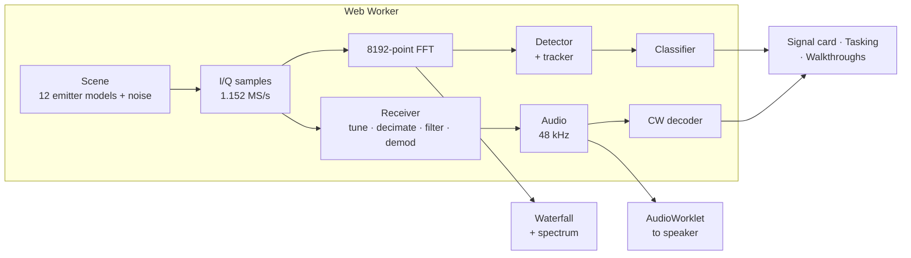

# SPECTRA

A browser-based **radio simulator**, **radio capture-the-flag**, and **ham radio
exam prep**. Everything runs client-side: no SDR hardware, no backend, no
account.

**[spectra-one.vercel.app](https://spectra-one.vercel.app)** — works on phones
and desktops.

Because the simulator places every emitter, it knows the ground truth for the
whole band. That is what lets it verify each walkthrough step against the
receiver's actual state, grade a CTF flag, and score an exam — none of which a
receiver on a live antenna can do.

## Radio simulator

**Signal environment.** A Web Worker synthesizes a 1.152 MS/s complex-baseband
(I/Q) slice of spectrum from a scene of emitters plus complex Gaussian noise.
Twelve emitter models:

| Kind | Modulation | Parameters |
|---|---|---|
| WFM | Broadcast FM, 75 kHz deviation, music/voice/tone message | power, message, seed |
| NFM | Narrowband FM voice | deviation, speech script and cadence |
| AM | Full-carrier AM voice | modulation depth |
| USB / LSB | Single sideband (Hilbert analytic signal) | message |
| CW | On-off keyed Morse, raised-cosine edges | text, WPM; or the real NCDXF beacon schedule |
| 2-FSK | Continuous-phase FSK packets | baud, deviation |
| OOK | On-off keyed sensor bursts | baud |
| LoRa | Chirp spread spectrum, cyclic-shifted up-chirps | spreading factor, bandwidth |
| PSK | QPSK bursts, linear pulse shaping | symbol rate |
| FHSS | Frequency hopper | hop span, dwell |
| Radar | Pulsed, intra-pulse linear FM | PRI, pulse width |

**Voice traffic.** 51 scripted transmissions in nine sets — a 2 m repeater, 2 m
simplex, a 70 cm net, airband, HF SSB, three talk-radio stations, and a fox
beacon — rendered to audio once with Kokoro TTS, then modulated through the
same DSP chain as every other emitter. What's being said appears as a live
transcript.

**Receiver.** Complex mix to DC → 385-tap FIR decimation → channel filter
(187-tap Hamming lowpass; 63-tap for WFM) → demodulator → 48 kHz audio through
an AudioWorklet. Seven modes:

- **WFM / NFM** — quadrature discriminator, de-emphasis
- **AM** — envelope detector with DC removal
- **USB / LSB** — Weaver method; the wrong sideband rejects the signal
- **CW** — BFO beats a tuned carrier at 650 Hz, then a 6th-order Butterworth
  bandpass as wide as the filter setting
- **Raw** — no demodulation

Bandwidth, squelch, and volume are adjustable. On phones the controls are
knobs and a draggable tuning ruler; on desktop, a digit-wise frequency dial
(scroll any digit).

**Display.** 8192-point FFT spectrum and scrolling waterfall. Pinch or wheel
to zoom around the cursor; tap a signal to lock onto it (a reticle tracks it
through zoom). Five colormaps, dB-range controls with auto-level, light and
dark modes.

**Detection and identification.** The noise floor is estimated as a low
percentile of the spectrum; runs 8 dB above it become emissions, with gap
bridging so a swept chirp or a carrier plus its sidebands count as one.
Emissions are tracked across frames with duplicate suppression and bandwidth
memory. A rule-based classifier (occupied bandwidth, duty cycle, spectral
crest) ranks candidate types with confidence. Tapping a signal opens a card:
what it is, whether the current mode is right for it (one tap to fix), the
live transcript, and a "confirm the ID" step graded against ground truth.

**Operating tools.**

- **Scanner** — steps through the band, stops on activity above the learned
  floor, holds, resumes.
- **Intercept log** — every transmission heard, UTC-stamped, with callsign,
  frequency, mode, and transcript.
- **CW decoder** — adapts to the sender's speed; narrowband detection on the
  note with lookahead thresholding. Tested through the full simulator and
  receiver chain: exact copy at 12–30 WPM, strong to weak signals.
- **Recording** — SigMF (`cf32_le` data + JSON sidecar) with detections as
  annotations; opens in inspectrum, IQEngine, and GNU Radio.

**Eight bands** to work: FM broadcast, airband, 40 m, the 915 MHz ISM band,
a 2.4 GHz drone link, a 2 m fox hunt, the 20 m NCDXF beacon network on its
real rotation schedule, and a wideband sandbox with one of everything.

## Radio CTF (Tasking)

Sixteen challenges, 3,650 points, five categories.

| Challenge | Category | Points |
|---|---|---|
| First Light | Recon | 100 |
| ISM Census | Recon | 200 |
| Beacon Traffic | Decode | 200 |
| Deep Cut | Decode | 350 |
| Diagonal Rain | Identify | 150 |
| Now You See It | Identify | 250 |
| Which Sideband | Identify | 200 |
| Carrier in the Clear | Analysis | 150 |
| Fox Hunt | Analysis | 250 |
| How Wide Is It | Analysis | 200 |
| Spread Factor | Analysis | 200 |
| Split the Pair | Intercept | 300 |
| Working the Input | Intercept | 300 |
| Below the Gate | Intercept | 250 |
| Net Traffic | Intercept | 250 |
| Catch the Rotation | Intercept | 300 |

- **Recon / Analysis** — count emitters, report a hidden carrier's frequency,
  measure occupied bandwidth, recover a LoRa node's spreading factor from its
  sweep.
- **Decode** — copy CW beacons, including one buried under a louder decoy with
  the noise floor raised.
- **Identify** — name a modulation from its waterfall signature.
- **Intercept** — solvable only by operating the receiver. Two beacons 350 Hz
  apart inside the stock filter (narrow it). A flag keyed on a repeater's
  input, 600 kHz below the output you find first. A beacon under the default
  squelch. A net whose traffic reaches your log only if you found its
  repeater and stayed on it. A beacon that transmits in one timed slot of a
  rotation.

Opening a challenge loads its scene into the live receiver, and the challenge
sheet shows a live readout (frequency, mode, bandwidth, decoder copy) while
you work. Flags are checked as SHA-256 of a salted, normalized answer
(case, whitespace, and underscores ignored); no plaintext flags ship in the
bundle. Each hint costs 15% of the challenge's points, floored at 40%. Rank
runs Unlicensed → Listener → Apprentice (25%) → Operator (50%) → Spectrum
Analyst (75%) → Signals Officer (100%). The result card shares as a text grid
with no spoilers.

## Guided walkthroughs

Nine lessons, 24 minutes total, each run on the live receiver. A coach card
says what to do and why, a ring marks the control, and the step advances only
when the receiver's state shows you did it (tests drive each lesson through
the real DSP chain). Each lesson ends by offering the challenge that tests
the skill; each of those challenges offers "Practice it first" until its
lesson is done.

| Walkthrough | Skill | Min | Leads to |
|---|---|---|---|
| Tune and listen | Reading the waterfall, tuning, choosing a demodulator | 2 | First Light |
| Pick the right mode | Matching AM and FM demodulators to what you see | 3 | Carrier in the Clear |
| Narrow the filter | Using bandwidth to separate overlapping stations | 3 | Split the Pair |
| Open the squelch | Setting the gate so weak signals get through | 2 | Below the Gate |
| Work a repeater | Inputs, outputs, and the 2 m offset | 3 | Working the Input |
| Scan the band | Finding activity with the scanner; logging it | 3 | ISM Census |
| Identify a signal | Naming a modulation from shape and sound | 3 | Diagonal Rain |
| Read the log | Monitoring a frequency; who is talking to whom | 3 | Net Traffic |
| Read a chirp | Bandwidth and spreading factor from a sweep | 2 | Spread Factor |

## Ham radio exam prep

**All 1,431 questions** from the current NCVEC pools, with the 14 figure
diagrams: Technician 2026–2030 (409), General 2023–2027 (423), Amateur Extra
2024–2028 (599). Every answer key was cross-checked against the published
letter at build time.

- **Reels** — a swipe feed, one question per screen. Tap or press A–D; a
  wrong answer reveals the correct one with its FCC Part 97 reference.
  Spaced repetition uses Leitner boxes 0–4: a correct answer moves a question
  up one box, a miss sends it to box 0, and the feed weights unseen and
  low-box questions first (80/40/20/8/3, plus 6 per prior miss). Filter by
  subelement, drill only your misses, and see readiness per subelement.
- **Practice exam** — one question drawn from each question group, which is
  how a volunteer-examiner session assembles the real test: 35 questions for
  Technician and General, 50 for Extra. No feedback until you submit; blanks
  count as wrong. Scored against the real pass marks (26/35 and 37/50).
  Results list your misses first, with a one-tap drill of just those.
- **Listen mode** — hands-free: each question is read, then its answer, at
  0.85× to 1.75×. "Knew it" / "review" feeds the same Leitner boxes as
  answering.
- **Narration** — every question and every answer pre-rendered with
  Kokoro-82M (voice `af_heart`), two clips per question, so playback is
  instant and offline. Falls back to the browser's speech synthesis for
  anything unrendered. See [docs/NARRATION.md](docs/NARRATION.md).

## Course and reference

- A 25-chapter course in five parts — Foundations; Electricity & Circuits;
  Radio Theory; Station Equipment; Propagation, Operations & Regulations —
  with interactive widgets and chapter quizzes. Adapted from The Radio Bench.
- A 284-term glossary, inline and searchable.
- A spectrum explorer: 100 kHz to 10 GHz on one zoomable log axis, with the
  bands and services on it.

## Deep links

Every view, challenge, pool, topic, and band has a URL. Parameters: `view`,
`c` (challenge id), `pool`, `topic`, `scenario`. A challenge link is
`/?c=split-the-pair`; a study link is `/?pool=general&topic=G5`. Parameters
are validated against an allowlist; unknown values fall back to the default
view instead of breaking.

## How it works


```mermaid
flowchart LR
  subgraph W["Web Worker"]
    SC["Scene<br/>12 emitter models + noise"] --> IQ["I/Q samples<br/>1.152 MS/s"]
    IQ --> FFT["8192-point FFT"] --> DT["Detector<br/>+ tracker"] --> CL["Classifier"]
    IQ --> RX["Receiver<br/>tune · decimate · filter · demod"] --> AU["Audio<br/>48 kHz"]
    AU --> CW["CW decoder"]
  end
  FFT --> WF["Waterfall<br/>+ spectrum"]
  AU --> AW["AudioWorklet<br/>to speaker"]
  CL --> UI["Signal card · Tasking<br/>· Walkthroughs"]
  CW --> UI
```

- **No server.** The deployed site is static files. The DSP worker generates
  16,384-sample blocks and posts spectrum frames, audio, and detections to the
  main thread; audio plays through an AudioWorklet.
- **The DSP is written from scratch in TypeScript**: radix-2 FFT, windowed-sinc
  FIR design, decimating channelizers, quadrature FM discriminator, Weaver SSB,
  Butterworth CW bandpass. The 12-emitter scene renders about 4× faster than
  real time in Node.
- **The simulator is the answer key.** Detector, classifier, CTF flags, and
  walkthrough steps are all checked against ground truth the worker already
  has.
- **235 tests**: FFT against a reference DFT, demodulator tone recovery and
  sideband rejection, CW encode → receiver → decode round-trips for every
  beacon challenge, each lesson's step checks against the real receiver, flag
  normalization, exam scoring, and CTF solvability (every rendered flag is
  proven decodable before it ships).

## Run it locally

Requires Node 20 or later.

```bash
npm install
npm run dev      # http://localhost:5173
npm test         # 235 tests: DSP, decoder, lessons, flags, scoring
npm run build    # typecheck, production build, prerendered signal pages
```

## Content pipelines

| Command | What it produces |
|---|---|
| `npm run pools:gen` | Typed, lazy-loaded modules for the three question pools, answer keys cross-checked |
| `npm run course:gen` | The course and glossary, ported from The Radio Bench |
| `npm run prerender` | A static, crawlable page for each signal type, plus `sitemap.xml` |
| `scripts/kokoro_render.py` | Exam narration, two clips per question ([docs/NARRATION.md](docs/NARRATION.md)) |
| `scripts/render_traffic.py` | The simulated voice traffic, from `scripts/radio-traffic.json` |

## Project layout

```
src/
  sim/        signal environment: emitters, voice bank, Morse, NCDXF schedule
  dsp/        FFT, filters, receiver, detector, CW keyer and decoder
  engine/     the DSP worker, the main-thread engine, and their protocol
  guide/      walkthroughs and the on-screen coach
  ctf/        Tasking challenges, flag checking, scoring, share card
  exam/       question pools, reels, practice exam, Listen mode, narration
  academy/    course, glossary, spectrum explorer
  scenarios/  the eight bands
  ui/         receiver, controls, sheets, signal card, app shell
```

Built with React, Vite, TypeScript, Tailwind CSS v4, Radix, Motion, Vaul,
uPlot, and Torph.

## Credits

- **Question pools**: the official NCVEC pools, released into the public domain
  by the NCVEC Question Pool Committee. Machine-readable transcription from
  [russolsen/ham_radio_question_pool](https://github.com/russolsen/ham_radio_question_pool)
  (Apache-2.0).
- **Course**: adapted from [The Radio Bench](https://github.com/jemcik/the-radio-bench),
  © 2026 Yevhen Yemchynskyi, MIT. See [`NOTICE`](NOTICE).
- **Narration**: [Kokoro-82M](https://huggingface.co/hexgrad/Kokoro-82M)
  (Apache-2.0), voice `af_heart`.
- **UI**: waveform and visualizer components from
  [ElevenLabs UI](https://github.com/elevenlabs/ui) (MIT), and the wheel picker
  from [@ncdai](https://github.com/ncdai/react-wheel-picker) (MIT).

## License

MIT. See [`LICENSE`](LICENSE).

SPECTRA is a simulator. Every signal is generated in your browser; it does not
receive or transmit real radio traffic.
